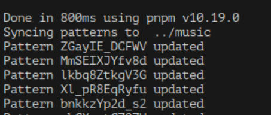
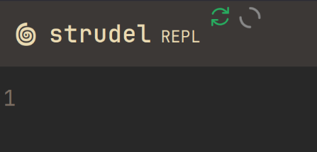

# strudel-extras

Userscript and local server for [Strudel REPL](https://strudel.cc).

Features:

- **Local directory sync** (requires setup) - save REPL patterns to plaintext files on every save.
- **Loading indicator for missing samples** - when sample is loading or unavailable.
- **Resizable sidebar** - to read reference guide with more comfort.

## Installation

1. Install browser addon for userscripts; I prefer Firefox and Greasemonkey.
2. Create new script and paste `userscript.js` content.
3. For sync only: close this repo, install `pnpm`, run `make run <path_to_dir>` to start the server. Keep it running.
4. Reload the page.

Server console should look like this:

## Indicators

- The first indicator changes red/green depending on sync status. If you don't use sync server - ignore it.
- The second one appears when sample is loading, from pattern or by click in the sidebar. If this indicator is always on - check the console. You might be ratelimited by GitHub (429 error). In that case stop coding and grab a tea.

## TODO

### Userscript

- [ ] BUG: Fix right arow width when sidebar is hidden
- [ ] Option to reload page on pattern change
- [ ] Enable/disable font ligatures

### Server

## License

[AGPL-3.0](https://www.gnu.org/licenses/agpl-3.0.en.html), see [Using Strudel in your Project](https://strudel.cc/technical-manual/project-start/).